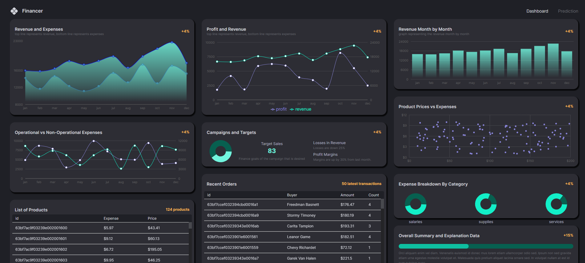
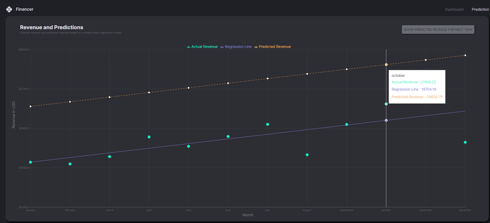

Finance Dashboard App
Welcome to our comprehensive finance dashboard application built using the MERN stack (MongoDB, Express.js, React.js, Node.js). This dashboard provides powerful financial insights and features a range of functionalities to enhance decision-making and data visualization.

Key Features
Interactive Data Visualization: Utilizes various chart types (e.g., line charts, bar charts, pie charts) to present financial data in a visually appealing and intuitive manner.

Real-time Transaction Updates: Displays the 50 most recent transactions with automatic refresh to ensure users have up-to-date information at all times.

Machine Learning Model Integration: Employs regression analysis to predict next year’s revenue, providing valuable forecasting capabilities for financial planning.

Technologies Used
Frontend: React.js for dynamic and responsive user interfaces.
Backend: Node.js and Express.js for server-side logic and API integration.
Database: MongoDB for efficient data storage and retrieval.
Installation and Setup
Clone the repository:

bash
Copy code
git clone https://github.com/yourusername/finance-dashboard.git
Install dependencies:

bash
Copy code
cd dashboard
npm install
Set up environment variables:

Create a .env file in the root directory and specify:

plaintext
Copy code
MONGODB_URI=your_mongodb_connection_string
Start the application:

bash
Copy code
npm start
Usage
Dashboard Overview: Upon launching the app, you will see an overview of financial metrics and charts.

Transactions: Navigate to the transactions section to view real-time updates of the latest transactions.

Machine Learning: Explore the predictive revenue analysis section to see forecasted revenue based on machine learning models.
